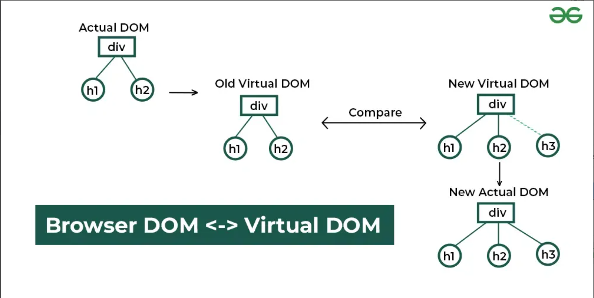
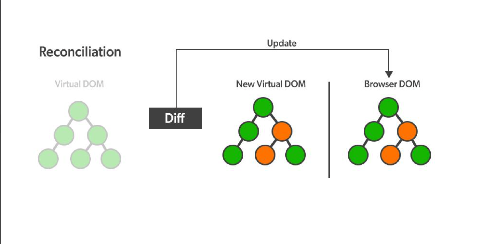

ReactJS is a component-based JavaScript library used to build dynamic and interactive user interfaces. It simplifies the creation of single-page applications (SPAs) with a focus on performance and maintainability
1. Front-end Library
2. Developed by facebook
3. buiding UI components
4. Created Virtual DOM in memory

*SPA stands for Single Page Application.*

- It is a web application that loads a single HTML page initially. As the user interacts with the app, it dynamically rewrites the current page with new data from the web server, instead of loading entire new pages.

*How React works as an SPA*

- React doesn't automatically make an app an SPA just by existing. React becomes an SPA when you use Client-Side Routing (typically with a library called react-router-dom).

*Here is the mechanism of how React handles navigation without reloading the page.*

The Secret: The <Link> Component vs <a> Tag
In HTML, to navigate, you use an anchor tag <a href="/about">About</a>.

When you click an <a> tag, the browser automatically makes a request to the server and reloads the page. This kills the SPA experience.
In React, we do not use <a> tags for internal links. We use <Link>.

import { BrowserRouter, Routes, Route, Link } from 'react-router-dom';

function App() {
  return (
    <BrowserRouter>
      <nav>
        {/* This is NOT a normal link. It is a React Link. */}
        <Link to="/">Home</Link>
        <Link to="/about">About</Link>
      </nav>

      <Routes>
        {/* React shows ONLY the component that matches the URL */}
        <Route path="/" element={<Home />} />
        <Route path="/about" element={<About />} />
      </Routes>
    </BrowserRouter>
  );
}

function Home() { return <h1>Home Page</h1>; }
function About() { return <h1>About Page</h1>; }

*The Step-by-Step Flow (The Magic)*
Here is what happens when you click <Link to="/about"> in a React SPA:

- User Clicks: You click the "About" link.
- Browser URL Changes: The address bar changes from localhost:3000/ to localhost:3000/about.
- Interception: The BrowserRouter sees that the URL changed.
- NO Reload: Critically, the browser does not refresh. It does not ask the server for a new HTML file.
- Matching: React Router looks at the new URL (/about) and compares it to your <Routes> config.
- Swapping: It sees that /about matches <Route path="/about" ... />.
- Rendering: React unmounts (removes) the <Home /> component and mounts (inserts) the <About /> component.
- Result: The text on the screen changes instantly. The music playing in the background (if you had an audio player) doesn't stop. The scroll position stays where it was. It feels like a native mobile app.

## What is the DOM(Document Object Model)?
To understand React, you must understand the DOM (Document Object Model).

When you write HTML, the browser takes that code and turns it into a tree-like structure of objects in the browser's memory. This structure is the DOM.

Think of the DOM as the "Live Screen" of your web page.

It is the bridge between your HTML code and what the user sees.
If you change the DOM (using JavaScript), the screen updates immediately.

## what is Virtual DOM?
This is React's "secret sauce" for speed.
You learned earlier that updating the real DOM is slow (it causes the browser to recalculate layouts and repaint pixels).
To solve this, React created a Virtual DOM.
How it works:
The Copy: When you run a React app, React creates a lightweight copy of the Real DOM entirely in JavaScript memory. This is the Virtual DOM. It is cheap and fast to change.
The Change: When you change data in your app (e.g., a user likes a post), React updates the Virtual DOM first (not the real one).
Diffing (Comparing): React now compares the new Virtual DOM with the old Virtual DOM. It figures out exactly what changed (e.g., "Only the heart icon turned red").
Reconciliation (Updating Real DOM): React takes only that specific change and updates the Real DOM in one efficient batch process.
Analogy:
Real DOM: A printed manuscript. Changing a sentence means rewriting the whole page and reprinting it.
Virtual DOM: A digital document and a "Track Changes" feature. You make changes digitally, compare it to the original, and only print out the specific paragraph that changed.

## How does React Work?

1. Actual DOM and Virtual DOM

Initially, there is an Actual DOM(Real DOM) containing a div with two child elements: h1 and h2.
React maintains a previous Virtual DOM to track the UI state before any updates.
2. Detecting Changes

When a change occurs (e.g., adding a new h3 element), React generates a New Virtual DOM.
React compares the previous Virtual DOM with the New Virtual DOM using a process called **reconciliation**.
3. Efficient DOM Update

React identifies the differences (in this case, the new h3 element).
Instead of updating the entire DOM, React updates only the changed part in the New Actual DOM, making the update process more efficient

### Reconciliation?
Reconciliation is the process React uses to figure out how to efficiently update the DOM (Document Object Model) when changes occur in the UI. React's goal is to update the page as efficiently as possible, without unnecessary re-rendering or slow performance.

 *working* **How ReactJS Reconciliation Works**
The reconciliation process involves the following steps:

1. Render Phase
React calls the *render()* method of a component to generate a new virtual DOM representation.
This new Virtual DOM is compared with the previous Virtual DOM snapshot.
2. *Diffing Algorithm*
React compares the old and new virtual DOM trees to determine the differences.
Instead of re-rendering the entire UI, React updates only the changed nodes.
3. Commit Phase
Once the differences are determined, React applies the updates to the real DOM in the most efficient way.
React batches updates and minimizes reflows and repaints for better performance.

#### What is the Render() Method in ReactJS?
The render() method is an essential part of *React class components* that determines what gets displayed on the user interface (UI). It plays a key role in rendering elements and updating the UI dynamically.

The render() method in React is the lifecycle method.
The render() method gets called automatically.
It must return JSX or null.
It cannot mutate state.
The logic and the calculation should be written and performed outside the render() method.
Syntax

class MyComponent extends React.Component {
    render() {
        return <h1>Hello, World!</h1>;
    }
}
**How do render() Work?**
The render() method is called every time React determines that a component’s state or props have changed. When this happens, React re-renders the component, calling the render() method to generate a new version of the UI.

Here’s a basic example of how the render() method works

import React, { Component } from 'react';
class Welcome extends Component {
    render() {
        return <h1>Hello, {this.props.name}!</h1>;
    }
}
export default Welcome;
Output: Hello.!

In the example above

Welcome is a class-based component.
The render() method returns a simple JSX element, which displays the name prop passed to the component.
Every time the name prop changes, the render() method will be triggered again to reflect the updated name in the UI.
Implementing render() Method
This React class component, Greeting, uses state to conditionally render a welcome message or login prompt based on the user's login status.

import React, { Component } from 'react';

class Greeting extends Component {
    constructor(props) {
        super(props);
        this.state = {
            name: 'Anjali',  // Initial state
            isLoggedIn: true,
        };
    }
    render() {
        // Conditional rendering based on state
        if (this.state.isLoggedIn) {
            return (
                

                    <h1>Welcome back, {this.state.name}!</h1>
                    <button onClick={() => this.setState({ isLoggedIn: false })}>Log out</button>
                

            );
        } else {
            return (
                

                    <h1>Please log in.</h1>
                    <button onClick={() => this.setState({ isLoggedIn: true })}>Log in</button>
                

            );
        }
    }
}

export default Greeting;
Output: Welcome Back Anjali-> [logout] -> please Log In ->[Log in]

### What is Diffing Alogrithm?
-Diffing Algorithm in React JS differentiates the updated and previous DOM of the application. DOM stores the components of a website in a tree structure.

-

-why diffing algorithm?
  -Improved performance: By limiting DOM manipulations, the application runs faster.
  -Smooth user experience: Users experience fewer lags, even in dynamic applications.
  -Optimized rendering: React can handle frequent updates in real-time without performance     bottlenecks.

-*working*-
  -First, the content is rendered on the webpage and the DOM tree is created.
  -On change in any content due to user interaction or change in data from API, React works on observable patterns, hence, whenever there is a change in the state, it updates the nodes in the virtual DOM
  -In reconciliation the old tree is compared to the newest version to determine the number of changes needed for updation.
  -After determining the changes a set of optimized and minimal instruction is created to implement on the real DOM.
  -These changes are then implemented and only content that changed is re-rendered on the web pages

  **Assumption for Diffing Algorithm**
 React uses a heuristic algorithm called the Diffing algorithm for reconciliation based on these assumptions:

 Elements of different types will produce different trees
  We can set which elements are static and do not need to be checked.
 React checks the root elements for changes and the updates depend on the types of the root elements,

 Element in different types: Whenever the type of the element changes in the root, react will scrap the old tree and build a new one i.e a full rebuild of the tree.
 Elements of the same type: When the type of changed element is the same, React then checks for attributes of both versions and then only updates the node which has changes without any changes in the tree. The component will be updated in the next lifecycle call.
**Advantages of Diffing Algorithm**
 It enables efficient updates and reduce the work need to reflect the changes
 It enhances the performance by updating only the required components/ nodes.
 Results in faster response while change by reducing the unwanted and unnecessary re-renderings.

 **Limitations of the Diffing Algorithm**
 While the diffing algorithm is highly efficient, there are some cases where improper use can lead to performance issues

 Missing or duplicate keys: Not providing unique keys for list items can result in unnecessary re-renders.
 Complex nested structures: In deeply nested components, the diffing process may take longer, although it is still optimized compared to manual DOM manipulation
