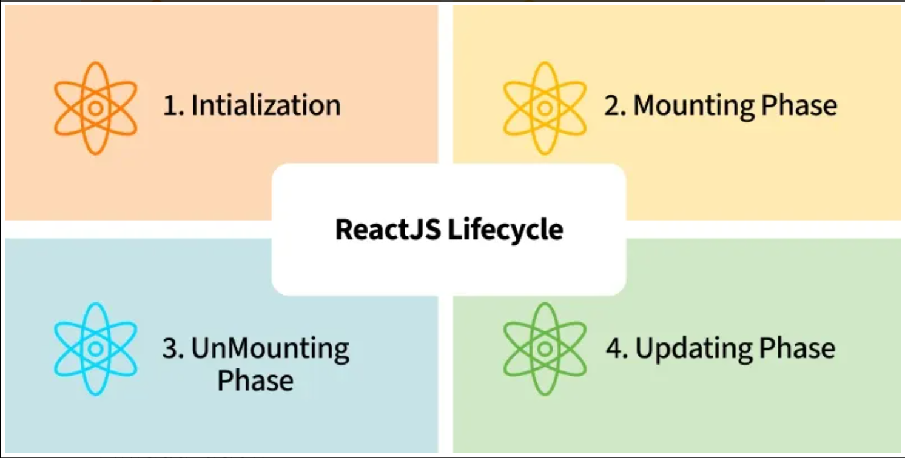

## Key Features of React ##

1. Virtual DOM
React uses a Virtual DOM to optimize UI rendering. Instead of updating the entire real DOM directly, React:

Creates a lightweight copy of the DOM (Virtual DOM).
Compares it with the previous version to detect changes (diffing).
Updates only the changed parts in the actual DOM (reconciliation), improving performance.
2. Component-Based Architecture
React follows a component-based approach, where the UI is broken down into reusable components. These components:

Can be functional or class-based.
It allows code reusability, maintainability, and scalability.
3. JSX (JavaScript XML)
React usesJSX, a syntax extension that allows developers to write HTML inside JavaScript. JSX makes the code:

More readable and expressive.
Easier to understand and debug.
4. One-Way Data Binding
React uses one-way data binding, meaning data flows in a single direction from parent components to child components via props. This provides better control over data and helps maintain predictable behavior.

5. State Management
React manages component state efficiently using the useState hook (for functional components) or this.state (for class components). State allows dynamic updates without reloading the page.

6. React Hooks
Hooks allow functional components to use state and lifecycle features without needing class components. Common hooks include:

useState: for managing local state.
useEffect: for handling side effects like API calls.
useContext: for global state management.
7. React Router
React provides React Router for managing navigation in single-page applications (SPAs). It enables dynamic routing without requiring full-page reloads.

#### ReactJS Lifecycle ####
 
Old Way (Class Components) vs Modern Way (Hooks)
**Phase 1: Mounting (Birth)**

This phase occurs when a component appears on the screen for the first time.

1️⃣ Initialization (Constructor vs useState)
Old Way — constructor

Used to initialize this.state

Bind methods

Runs once before the first render

Modern Way — useState

No constructor needed

State is initialized directly inside the function

Cleaner and simpler

2️⃣ Running Code Once
(componentDidMount vs useEffect)

This is where you typically fetch data from an API.

Old Way — componentDidMount

A lifecycle method inside class components

Automatically called after the first render

Modern Way — useEffect

Uses useEffect with an empty dependency array []

Runs only once after the first render
🧩 Comparison Code
// --- OLD WAY (Class Component) ---
class UserProfile extends React.Component {
  constructor(props) {
    super(props);
    this.state = { data: null }; // 1. Initialize State
  }

  componentDidMount() {
    // 2. Run once on mount (Fetch Data)
    fetch('/api/user').then(data => this.setState({ data }));
  }

  render() {
    return 
{this.state.data}
;
  }
}
// --- MODERN WAY (Functional Component) ---
import React, { useState, useEffect } from 'react';

function UserProfile() {
  const [data, setData] = useState(null); // 1. Initialize State

  useEffect(() => {
    // 2. Run once on mount (Fetch Data)
    fetch('/api/user').then(res => setData(res));
  }, []); // Empty array means "Run once"

  return 
{data}
;
}
**Phase 2: Updating (Growth)**

This phase occurs when state or props change.

1️⃣ Reacting to Changes
(componentDidUpdate vs useEffect)
Old Way — componentDidUpdate

Runs after every update

Requires manual if checks to detect changes

Modern Way — useEffect

Uses a dependency array

React automatically runs the effect only when specified values change

2️⃣ Performance Optimization
(shouldComponentUpdate vs React.memo)
Old Way — shouldComponentUpdate

You manually return true or false

Controls whether a component should re-render

Modern Way — React.memo

Higher-Order Component

Automatically prevents re-renders if props don’t change

🧩 Comparison Code
// --- OLD WAY ---
class TodoList extends React.Component {
  componentDidUpdate(prevProps) {
    if (this.props.userId !== prevProps.userId) {
      console.log("User ID changed! Fetching new data...");
      this.fetchData();
    }
  }

  render() {
    return 
Todo List
;
  }
}

// --- MODERN WAY ---
function TodoList({ userId }) {
  useEffect(() => {
    console.log("User ID changed! Fetching new data...");
    fetchData();
  }, [userId]); // Effect runs only when userId changes

  return 
Todo List
;
}

**Phase 3: Unmounting (Death)**

This phase occurs when a component is removed from the screen, such as when navigating to another page.

Cleanup
(componentWillUnmount vs useEffect cleanup)

Cleanup is essential to:

Remove event listeners

Clear timers

Prevent memory leaks

Old Way — componentWillUnmount

Separate lifecycle method

React calls it before the component is removed

Modern Way — useEffect Cleanup

Return a function inside useEffect

React automatically runs it on unmount

🧩 Comparison Code
// --- OLD WAY ---
class Timer extends React.Component {
  componentDidMount() {
    this.timerID = setInterval(() => console.log("tick"), 1000);
  }

  componentWillUnmount() {
    clearInterval(this.timerID);
  }

  render() {
    return 
Timer
;
  }
}

// --- MODERN WAY ---
function Timer() {
  useEffect(() => {
    const timerID = setInterval(() => console.log("tick"), 1000);

    // Cleanup logic
    return () => {
      clearInterval(timerID);
    };
  }, []);

  return 
Timer
;
}

Special Cases (Rarely Used Now)
getDerivedStateFromProps
Old Way

Static lifecycle method

Used to sync state with props

Often confusing and error-prone

Modern Way

Avoid syncing state to props

Compute derived values directly during render

✅ Modern Derived State Example
function User({ userProp }) {
  const fullName = `${userProp.firstName} ${userProp.lastName}`;
  return 
{fullName}
;
}

| Concept              | Old Way (Class Components)   | Modern Way (Functional Components + Hooks) |
| **Define Component**   | `class App extends Component`| `function App()` |
| **Initialization**     | `constructor()`              | `useState()` |
| **Mounting / API Call** | `componentDidMount()`       | `useEffect(..., [])` |
| **Updating / Watcher**  | `componentDidUpdate()`       | `useEffect(..., [var])` |
| **Unmounting / Cleanup** | `componentWillUnmount()`| `return () => { ... }` inside `useEffect`|
| **Prevent Re-render**   | `shouldComponentUpdate()`   | `React.memo` |
| **Derived State**     | `getDerivedStateFromProps()`  | Compute during render (no state) |

